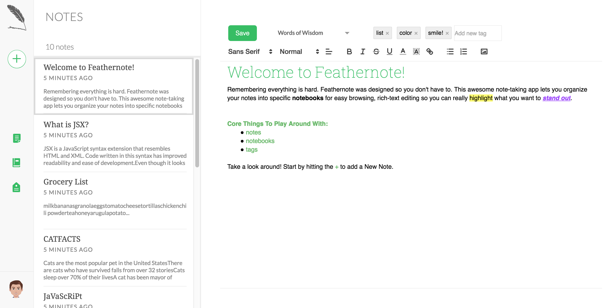
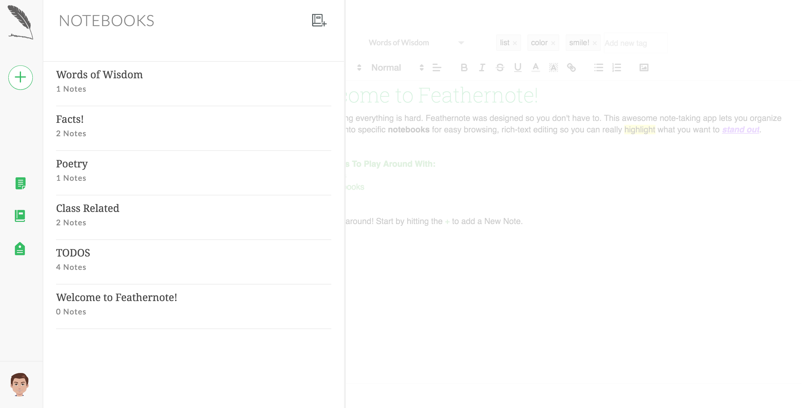
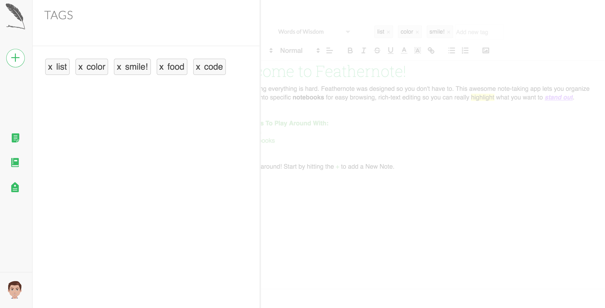

# FeatherNote

[FeatherNote live][heroku]

[heroku]: http://feathernotes.herokuapp.com/#/

FeatherNote is a full-stack web application inspired by Evernote.  It utilizes Ruby on Rails on the backend, a PostgreSQL database, and React.js with a Redux architectural framework on the frontend.  

## Features & Implementation

### Note Taking and Editing

  On the backend, the notes are stored in a single table in the database, which contains columns for `id`, `author_id`, `title`, `body`, `notebook_id` and `updated_at`.  Upon login, an API call is made to the database which populates the store with the current user's notes using its relation.  These notes are held in the frontend as a `notes` slice of state which is managed by the notes reducer until the user's session is destroyed.  

  Notes are rendered in two different components: the `NoteDetail` component,  displays the full note detail which is editable and shows all note text.  The `NoteIndex` renders all of the `NoteIndexItem`s as subcomponents with short preview views of the notes and their most recent update. It also filters the notes based on if there is a current Notebook or Tag selected. The UI of the `NoteIndex` is taken directly from Evernote for a professional, clean look:  

Note editing is implemented using the react-quill ( with Quill.js) library, allowing for a Word-processor-like user experience.

### Notebooks

Notebooks are stored in a notebook table in the database.  The `Notebook` table contains three columns: `title`, `id`, and `author_id`.

The React component structure for notebooks was simpler than notes, but linking it together with the notes was the challenge: the `NotebookIndex` component renders a list of `NotebookIndexItem`s as subcomponents as well as a button that opens a modal to Add a new notebook. Upon selection of notebook the `NoteIndex` component renders again, filtering a list of notes just associated with that notebook. A view of the `NotebookIndex`:

### Tags

Tags are stored in the database through a `tag` table and a join table called `taggings`.  The `tag` table contains the columns `id` and `name` while `taggings` contains three columns: `id`, `tag_id`, and `note_id`.  

On the frontend the tags slice of state state is managed by the `TagsReducer`. Tags are rendered in the detail view of a note, but they also have their own `TagIndex` component where you can select tags for the `NoteIndex`

## Future Directions for the Project

I plan to continue work on this project further.  The next plans for Feathernote are outlined below.

### Search

Searching notes is a standard feature of Evernote. This search will look go through note titles, notebook titles, note content and tags. clicking on a result will bring select that note as your current note in view.

### AutoSave

This feature is a staple in Evernote note-taking. It will monitor user input within the note and its notebook dropdown and tag input. It will set a short timer with setTimeOut after input has stopped and if that timer is reached before the user begins putting in more input, it will trigger a save. if the user keeps inputting, then the timer gets cleared.
